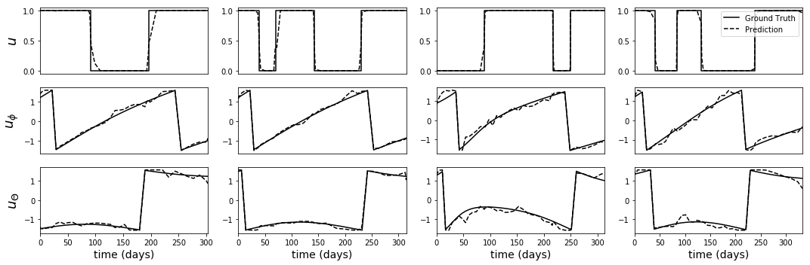

# Deep Learning on Interplanetary Transfers

We train deep neural networks on a large dataset of state-control pairs (for a spacecraft).
The state-control pairs are extracted from trajectories corresponding to the optimal orbital transfer from Earth to Mars.

Code for dataset generation can be found [here](https://github.com/cisprague/act-ai).

We use Keras with Tensorflow backend for neural network training.

For more details, see paper: 
['Machine learning and evolutionary techniques in interplanetary trajectory design'. Izzo D, Sprague C, Tailor D. (2018)](https://arxiv.org/abs/1802.00180)

___

### Environment setup

To reproduce environment, execute
`pip install -r requirements.txt`.

### Optimal vs NN Control

